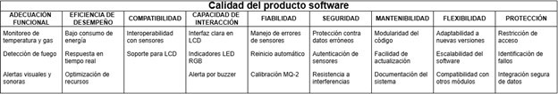
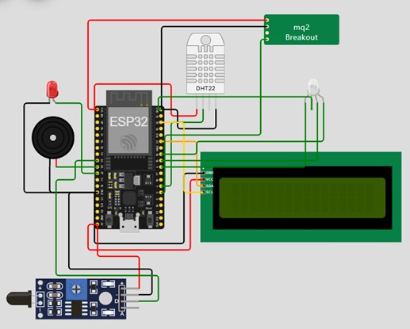

# Sistema IoT para Detección de Incendios en los Cerros Orientales de Bogotá 

## Estructura de la documentación
1. [Resumen General](#resumen-general)
    1. [Motivación](#motivación)
    2. [Justificación](#justificación)
2. [Solución Propuesta](#solución-propuesta)
    1. [Restricciones de diseño](#restricciones-de-diseño)
    2. [Arquitectura](#arquitectura)
    3. [Desarrollo teórico modular](#desarrollo-teórico-modular)
    4. [Estándares de diseño de ingeniería aplicadas](#estándares-de-diseño-de-ingeniería-aplicadas)
    5. [Esquemático de hardware](#esquemático-de-hardware)
3. [Configuración experimental](#configuración-experimental)
    1. [Resultados y análisis](#resultados-y-análisis)
4. [Autoevaluación del protocolo de pruebas](#autoevaluación-del-protocolo-de-pruebas)
    1. [Retos presentados](#retos-presentados)
5. [Conclusiones](#conclusiones)
    1. [Trabajo Futuro](#trabajo-futuro)
6. [ACTAS DE TRABAJO](#actas-de-trabajo)
7. [Anexos](#anexos)
    1. [Anexo A. Requerimientos funcionales del sistema](#anexo-a-requerimientos-funcionales-del-sistema)
    2. [Anexo B. Requerimientos no funcionales del sistema](#anexo-b-requerimientos-no-funcionales-del-sistema)
    3. [Anexo C. Esquemático del hardware](#anexo-c-esquemático-del-hardware)
    4. [Anexo D. Sitio web simulado](#anexo-d-sitio-web-simulado)
    5. [Anexo E. Documentación del código](#anexo-e-documentación-del-codigo)
8. [Referencias](#referencias)

---

## Resumen General

Este escrito presenta la segunda fase de desarrollo de un prototipo funcional basado en un sistema IoT, cuyo objetivo es monitorizar en tiempo real las condiciones ambientales en los cerros orientales de la ciudad de Bogotá, Colombia para detectar incendios de forma temprana. La solución desarrollada emplea un **microcontrolador ESP32** junto con sensores de temperatura, humedad, gases, humo y un sensor de llama para evaluar las condiciones del entorno. 

En esta nueva etapa, el sistema se ha complementado con un **tablero de control** accesible desde cualquier navegador web dentro de una WLAN local proporcionada por la alcaldía. Este tablero permite a las autoridades visualizar en tiempo real los valores actuales de las variables ambientales monitorizadas, acceder a un histórico reciente de mediciones, recibir notificaciones inmediatas ante eventualidades, y desactivar remotamente las alarmas físicas activadas in situ. Todo el sistema está alojado en un servidor web embebido dentro del propio ESP32, garantizando una respuesta rápida y autónoma sin depender de servicios externos. 

### Motivación

Los cerros orientales de Bogotá han sido, desde siempre, un área de gran valor ecológico. No obstante, la combinación de condiciones como la sequía y la intervención humana los hace vulnerables a incendios forestales. Identificar estos incendios en sus etapas iniciales es clave para reducir daños y salvaguardar tanto el ecosistema como a las personas que habitan en sus alrededores. [1]. La capacidad de monitorizar en tiempo real y desde cualquier dispositivo conectado a la red local permite a las autoridades tomar decisiones informadas y rápidas ante posibles emergencias, mejorando significativamente los tiempos de respuesta y la eficacia de las intervenciones. 

### Justificación

La implementación de un sistema de detección temprana de incendios con un tablero de control en tiempo real garantiza no solo una respuesta inmediata ante condiciones de riesgo, sino también una gestión eficiente de los recursos disponibles para combatir emergencias. El servidor web embebido en el ESP32 elimina la necesidad de infraestructuras complejas o servicios en la nube, proporcionando una solución autónoma y resiliente que puede operar incluso en condiciones de conectividad limitada. La visualización de datos históricos permite además identificar patrones y tendencias que podrían anticipar situaciones de riesgo antes de que se conviertan en emergencias, contribuyendo así a la prevención efectiva de incendios en esta zona ecológicamente sensible.  

---

## Solución propuesta

### Restricciones de diseño

Para esta fase del reto, resultó importante definir las nuevas restricciones de diseño. Estas restricciones se han categorizado en dos grupos distintos: por un lado, aquellas que definen las funcionalidades específicas que el sistema debe realizar para satisfacer los objetivos propuestos [2]; y por otro, aquellas restricciones que establecen parámetros de eficiencia, usabilidad y robustez que el sistema debe cumplir [2]. Esta clasificación permite organizar metódicamente las exigencias que guiarán el proceso de implementación de este reto. 

La especificación detallada de los requerimientos funcionales se presenta en el [Anexo A](#anexo-a-requerimientos-funcionales-del-sistema), y los requerimientos no funcionales en el [Anexo B](#anexo-b-requerimientos-no-funcionales-del-sistema). 

### Arquitectura

La arquitectura que se implementó de nuevo es un sistema basado y centralizado a las funcionalidades y capacidades con las que cuenta el microcontrolador **ESP32**. Para la aplicación de los requerimientos solicitados aprovechamos la capacidad con la que cuenta el ESP32 de funcionar como un servidor embebido para el alojamiento de una página web que muestre información del ambiente, actual como histórica. Así mismo nos seguimos apoyando en los sensores y actuadores de la marca Sunfounder, los cuales no presentan cambios, son los mismos utilizados en el **Challenge #1**. Estos son: 

* **DHT11.** Sensor que detecta el porcentaje de humedad en el ambiente, así como la temperatura en grados centígrados.
* **Flame Sensor Module.** Sensor infrarrojo encargado y calibrado para la detección de la presencia de fuego. 
* **MQ-2 Gas Sensor.** Sensor encargado de medir la cantidad de partículas por millón de CO presentes en el ambiente. 

Y los actuadores utilizados son los siguientes:

* **Led Rojo.** Actuador que se enciende siempre que el estado de alerta se presente.
* **Led RGB.** Actuador que cambia de color dependiendo del estado del ambiente.
* **Buzzer.** Actuador que emite un ruido que simboliza la presencia de una alerta.
* **Display LCD 16x2.** Actuador que muestra in situ el estado e información del ambiente 

Además de estos también se utilizó como actuador un **computador** para acceder a la página web almacenada en el ESP32, que cumplía la función de servidor, alojando el sitio web. El siguiente diagrama ilustra el funcionamiento de la arquitectura planteada tanto del hardware (ilustrando como todas las conexiones pasan por el ESP32) y del software (ilustrando como el comportamiento del sistema lo realiza en su totalidad el ESP32): 

<p align="center">
    
</p>

Cabe aclarar el porqué de que el Laptop se interprete como sensor y actuador, ya que este según los requerimientos funciona primordialmente como un actuador al mostrar todos los datos presentes e históricos con los que se cuenten, y además de esto cuenta con la funcionalidad de apagar la alerta de incendio, por lo que al apagarla envía información al ESP32. 

### Desarrollo teórico modular

El sistema sigue una arquitectura modular dividida en cinco componentes: inicialización del sistema, sensores, procesamiento, actuadores y servidor web. Este diseño permite la recolección de datos ambientales, su análisis en tiempo real, la generación de alertas cuando hay condiciones de riesgo y el acceso remoto a la información a través de una interfaz web. Lo anterior representado mediante un diagrama de flujo UML de actividades que se presenta a continuación. 

<p align="center">
  
</p>

### Estándares de diseño de ingeniería aplicadas

Seguimos los lineamientos de los siguientes estándares para la realización del reto: 

* **ISO 7240-1:2014. Fire detection and alarm systems — Part 1:** General and definitions  Este estándar hace referencia a sistemas de detección y alarmas de incendios, requerimientos para su interconexión, instalación y pruebas. Además, menciona el funcionamiento esperado por este tipo de sistemas [3]. 

* **ISO 25010. Calidad del producto software.** Hace referencia al grado de satisfacción que alcanza el producto de software al ser utilizado por el usuario aportando valor [4]. 

<p align="center">
  
</p>

* **ISO 22320:2018. Security and resilience — Emergency management — Guidelines for incident management.**  Este estándar marca las pautas para el manejo de incidentes, así como la importancia de comunicar en caso de un incidente [5]. 

* **RFC 7230 Hypertext Transfer Protocol (HTTP/1.1):** Message Syntax and Routing. Este estándar marca como se deben estructurar mensajes HTTP asi como el manejo de conexiones como lo son TCP/IP [8]. 

### Esquemático de hardware

El esquemático de hardware se realizó en la plataforma de Wokwi, en el [Anexo C](#anexo-c-esquemático-del-hardware) se encuentra una imagen del esquemático realizado, igualmente se encuentra la URL del esquemático en sí. 

---

## Configuración experimental

Tras la realización del esquemático de hardware en la plataforma de **Wokwi**, donde nos aseguramos de un correcto funcionamiento nos dispusimos a la elaboración del prototipo experimental de la solución, dicho prototipo no varía en forma en cuanto al prototipo del Challenge #1 a excepción de la página web la cual si es completamente nueva. La siguiente imagen ilustra el prototipo construido: 

<p align="center">
  
</p>

Posterior a ello se subió el código al ESP32 para disponernos a comprobar su correcto funcionamiento, de los sensores, actuadores y conexión con la página web. El archivo .html encontrado en el [Anexo D](#anexo-d-sitio-web-simulado) muestra el funcionamiento del sitio web con valores simulados. 

Fue necesario configurar el ESP32 para que se pudiera conectar a la red. El servidor web embebido se implementó directamente en el ESP32, alojando el tablero de control dentro del microcontrolador. Esto posibilitó que se pudiera acceder desde cualquier navegador web conectado a la misma red, sin necesidad de una infraestructura adicional.   

Para asegurar el procesamiento en tiempo real, se implementaron tareas en un hilo secundario utilizando FreeRTOS para la lectura de sensores, tras descubrir que las interrupciones ISR no podían acceder a la comunicación serial necesaria debido a limitaciones del hardware del ESP32. Esta solución, aunque requirió modificaciones significativas al código, garantizó la capacidad de respuesta del sistema durante todas las operaciones. 

Durante las pruebas experimentales se simularon diferentes condiciones ambientales para verificar el correcto funcionamiento de todo el sistema integrado. 

### Resultados y análisis  

En el momento de la captación de los resultados del sistema su funcionamiento fue satisfactorio según los requerimientos solicitados, las mediciones que se consiguieron sobre salen los márgenes seguros solicitados, pero esto se debe a las condiciones del laboratorio en el cual se realizó el prototipo y las pruebas de este. En el [Anexo E](#anexo-e-documentación-del-codigo) se encuentran video que ilustran el funcionamiento del sistema, de los sensores, la página web y la interacción entre ellos. 

---

## Autoevaluación del protocolo de pruebas 

Para este reto se llevó a cabo una validación integral del prototipo diseñado para el reto, asegurando el cumplimiento de los lineamientos establecidos para la solución, así como las restricciones definidas. 

Inicialmente, se verificó el correcto funcionamiento del montaje realizado en el primer reto, ya que este servía como base para el desarrollo del actual desafío. Se revisaron y corrigieron errores identificados en la retroalimentación anterior, optimizando el rendimiento del sistema y asegurando que todos los requerimientos se cumplían. 

Se realizó el montaje del prototipado físico, en el cual se ejecutaron las pruebas correspondientes para verificar el correcto funcionamiento. Esto permitió avanzar con la implementación del tablero de control alojado en un servidor web embebido dentro del ESP32, lo que facilitaba el acceso en tiempo real a la información sobre las condiciones ambientales capturadas por los diferentes sensores. 

Una vez completado el montaje físico y teniendo el código implementado bien estructurado y funcional, se procedió a realizar diversas pruebas de validación. Estas pruebas se enfocaron en verificar la correcta lectura de los sensores, el envío de datos para su visualización en la página web y el cumplimiento de los diferentes requisitos establecidos para el sistema. 

Se evaluó el funcionamiento del sistema bajo diferentes condiciones para garantizar su fiabilidad y precisión en la detección de posibles incendios. También se comprobó la respuesta del sistema ante situaciones de alarma, verificando tanto la notificación in situ como la visualización en el tablero de control del servidor web y la capacidad para desactivar las alarmas remotamente. 

Al finalizar las respectivas pruebas y realizar los ajustes necesarios cuando se requirió, se pudo evidenciar que el sistema cumplía satisfactoriamente con los requisitos establecidos.  

### Retos presentados 

A lo largo del desarrollo del reto, surgieron diversos problemas y desafíos que tuvieron un impacto significativo en su progreso. Esto representó un desafío adicional para el equipo, que buscó soluciones efectivas para superar los obstáculos sin comprometer la entrega del reto. La presencia de estos distintos problemas no se dio de inicio, sino que algunos de ellos aparecieron hasta prácticamente el último momento. 

Inicialmente el primer desafió que se presento fue la implementación de que las mediciones se realizen en una interrupción ISR o hilo secundario al hilo de ejecución del programa. Al momento de realizar la interrupción con ISR nos topamos con que dicho tipo de interrupciones no cuentan con la capacidad de acceder a la comunicación serial, comunicación necesaria para la recolección de las mediciones del entorno, esto debido a limitaciones del hardware del ESP32, que según la investigación realizada por el equipo dice que las rutinas ISR tienen restricciones importantes, incluyendo la imposibilidad de realizar operaciones de bloqueo como la comunicación serial extendida [6]. El registro destinado para la recolección de datos por el puerto serial no se puede acceder durante una interrupción ISR, por lo cual debimos de implementar un hilo secundario con FreeRTOS para cumplir con este requisito. 

Durante la implementación del hilo secundario con FreeRTOS tuvimos que volver a versiones no tan recientes del código para su implementación lo que significó una demora significativa en el proceso de pruebas al tener que añadir funcionalidades previamente implementadas. Esta adaptación sigue las recomendaciones de Espressif Systems que establece: "para aplicaciones complejas con múltiples tareas concurrentes, es preferible utilizar FreeRTOS para la gestión de tareas en lugar de depender exclusivamente de ISRs" [7]. 

Cabe resaltar que el proceso de probar el código era bastante tardío al momento de cargar el código al ESP32 lo que extendió el tiempo de trabajo necesario para asegurarnos de su correcto funcionamiento. 

Por último, pero para nada menos importante el último día de pruebas luego de mover el computador al que estaba conectado la ESP32 con la que contábamos, este dejo de funcionar en su totalidad, así mismo el cable de alimentación empezó a presentar problemas, luego de cambiar el ESP32 por otro con características físicas iguales no se volvio a presentar el problema, y todo funciono como se esperaba en un inicio. 

---

## Conclusiones 

Tomando en cuenta el contexto del desafío presentado el desarrollo de un sistema IoT con las funcionalidades creadas tiene una utilidad y potencial enorme para el cuidado y mantenimiento de los ecosistemas naturales de Bogotá y de sus afueras, para de este modo poder generar planes de acciones u otros sistemas IoT encargados de preservar y cuidar estos espacios. La implementación de la página web brinda flexibilidad y facilidades a las autoridades pertinentes de acceder y conocer sobre el estado de estos espacios a pesar de la distancia. 

Saliéndonos del contexto del desafío y enfocándonos al prototipo creado y sus capacidades, estas tienen gran aplicabilidad en diversos sectores económicos a nivel mundial y a nivel país. La funcionalidad de una página web que ilustre el estado de un ecosistema, producto o servicio en tiempo real, así como se mencionó previamente, otorga una flexibilidad y facilidad que pueden convertirse en una ventaja competitiva para una empresa siempre y cuando este bien pensado e implementado. 

### Trabajo Futuro 

Como trabajo futuro del reto, se planea mejorar el sistema mediante la implementación de un modelo predictivo que analice los datos históricos para anticipar posibles incendios antes de que ocurran. También se busca crear un sistema de respaldo que mantenga el funcionamiento ante fallos del hardware, junto con mejoras en el ahorro de energía utilizando modos de bajo consumo del ESP32. Además, se considera desarrollar una aplicación para teléfonos que funcione incluso sin conexión y envíe alertas directas a los equipos de emergencia. Estas mejoras aumentarán la utilidad del sistema para proteger no solo los cerros orientales de Bogotá sino también otras zonas naturales vulnerables a incendios. 

Así mismo un almacenamiento de los datos históricos para fortalecer el modelo predictivo y mejorar el manejo y mantenimiento de los páramos orientales. 

---

## ACTAS DE TRABAJO 

En el momento en que iniciamos la planeación de como dividirnos el challenge nos encargamos de dividirnos el trabajo según diferentes tareas las cuales fueron las siguientes que muestra la imagen: 

<p align="center">
  
</p>

Estas estaban dirigidas a corregir errores del Challenge #1, y al desarrollo de los nuevos requerimientos del Challenge #2. 

Luego de este trabajo realizado en la semana del 11 al 18 de marzo. El día 18 de marzo durante las horas de clase nos encargamos de corregir las mediciones en un hilo aparte con FreeRTOS (trabajo que se extendió hasta el día 20) y la construcción del prototipo, así como la realización de las primeras pruebas. 

El día 20 de marzo se terminó el código con el hilo separado con FreeRTOS y se continuo con la realización de pruebas. 

El día 21 de este mismo mes fue el último día de pruebas, donde se presentó el desafío del ESP32 que dejo de funcionar, y se acabó el proceso de pruebas satisfactoriamente. 

---

## Anexos

### Anexo A. Requerimientos funcionales del sistema. 


| ID    | Descripción                                                                                           |
|-------|-------------------------------------------------------------------------------------------------------|
| RF-01 | El sistema debe implementar un servidor web embebido en el ESP32 para alojar el tablero de control.   |
| RF-02 | El tablero de control debe ser accesible desde cualquier navegador web dentro de la WLAN local proporcionada por la alcaldía. |
| RF-03 | El sistema debe mostrar en el tablero de control los valores actuales de las variables físicas monitorizadas (temperatura, humedad, gases, humo y llama). |
| RF-04 | El sistema debe presentar un histórico reciente de las mediciones realizadas para cada variable monitorizada. |
| RF-05 | El sistema debe emitir notificaciones en el tablero de control cuando se detecten condiciones de riesgo. |
| RF-06 | El sistema debe permitir desactivar remotamente las alarmas físicas desde el tablero de control. |
| RF-07 | La medición de variables debe ejecutarse desde un ISR o hilo diferente al hilo principal de ejecución. |

### Anexo B. Requerimientos no funcionales del sistema. 

| ID      | Descripción                                                                                           |
|---------|-------------------------------------------------------------------------------------------------------|
| RNF-01  | El tablero de control debe ser responsive, permitiendo su visualización desde PCs o teléfonos celulares. |
| RNF-02  | El sistema debe garantizar actualizaciones en tiempo real de los datos mostrados en el tablero, con un retraso máximo de 5 segundos. |
| RNF-03  | La interfaz del tablero de control debe ser intuitiva y de fácil uso para las autoridades locales.     |
| RNF-04  | El sistema debe optimizar el uso de recursos del ESP32 para garantizar el funcionamiento simultáneo de la detección de variables y el servidor web. |
| RNF-05  | No se permite el uso de servicios externos como MQTT para la comunicación entre sensores y tablero.    |

### Anexo C. Esquemático del hardware 

<p align="center">
  
</p>

[Simulación Wokwi](https://wokwi.com/projects/422470901977570305)

### Anexo D. Sitio web simulado. 

<p align="center">
  
</p>

### Anexo E. Documentación del codigo

```ino

```

---

## Referencias

[1] J. M. A. L. King, "Challenge#1 Statement", Microsoft Teams, 17 de febrero de 2025. [En línea]. 

[2] ISO/IEC/IEEE. (2011). "Systems and software engineering - Requirements engineering". ISO/IEC/IEEE 29148:2011. 

[3] ISO 22320:2018. Security and resilience — Emergency management — Guidelines for incident management (2018). [En línea]. Disponible: https://www.iso.org/obp/ui/en/#iso:std:iso:22320:ed-2:v1:en [Accedido: Feb. 17, 2025]. 

[4] ISO 25000. "ISO/IEC 25010". [En línea]. Disponible: https://iso25000.com/index.php/normas-iso-25000/iso-25010 [Accedido: Feb. 17, 2025]. 

[5] ISO 7240-1:2014(en). Fire detection and alarm systems — Part 1: General and definitions (2014). [En línea]. Disponible: https://www.iso.org/obp/ui/en/#iso:std:iso:7240:-1:ed-3:v1:en [Accedido: Feb. 17, 2025]. 

[6] N. Kolban, "Kolban's Book on ESP32: Programming for the ESP32," Leanpub, 2018. 

[7] Espressif Systems, "ESP32 Technical Reference Manual," Ver. 5.3, 2022. [En línea]. Disponible: https://www.espressif.com/sites/default/files/documentation/esp32_technical_reference_manual_en.pdf 

[9] RFC 7230(en), “Hypertext Transfer Protocol (HTTP/1.1): Message Syntax and Routing”, 2014 [En línea]. Disponible: https://datatracker.ietf.org/doc/html/rfc7230 

---